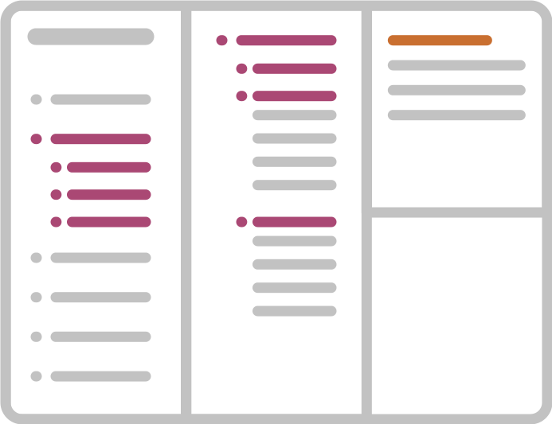
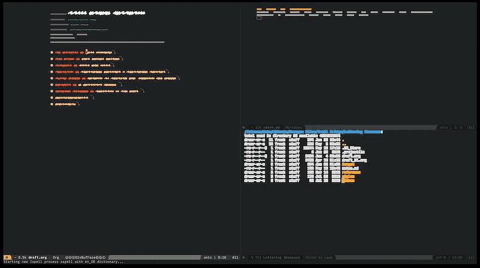

<div align="center">

<h1><a href="https://github.com/frankjonen/emacs-for-writers">Emacs For Writers</a></h1>
</div>

Installation | Introduction | Keyboard Shortcuts | System Requirements | Project Management | Caveats | Tips

***
Got some value out of this? Want to support further versions?

***

<div align="center">
    
</div>

## Intent
1. To get writers without an overbearing amount of tech literacy set up with a tool otherwise prohibitive for
them to get started with.
2. Show an easy to follow step-by-step guide to install and configure the most powerful writing environment to date.
3. Provide a ready-made Emacs configuration, geared towards writers.

And most importantly, to get you started quickly and save you the countless hours I've spent digging through all of
this. This configuration is intended as a starting point on your journey. No system is ever finished and this puts
you in the driver's seat.

***
## What is this?

Whit this `.spacemacs` Emacs configuration you're looking at about 90% of my personal Emacs setup. The rest is
comprised of functions too specific to include in a public releases. It won't affect regular use at all.

I'm sharing this because I've struggled at the beginning to get Emacs set-up the way I wanted it to be and actually
have it work the way I intended it to. Since the it freed me up in my writing, planning and collaboration
tasks immensely.

If you're a writer who's not shy about a little bit of a challenge and you want
to give your workflow a boost, this might be for you.

## Who this is for

> Nothing worth having is ever going to come easy.

- If you're bothered by word processors constantly getting in your way and messing with the way *you* want to express
yourself, what words you can use, this is for you.
- If you've used Markdown apps before and want something more, this is for you. Emacs does Markdown very well, but
once you've used `org-mode` for a bit, you're hooked.
- If you're not afraid of a little work to set up your tool in exchange of a vast new word, this is for you.
- If you want to create the way for your writing is managed instead of cookie cutter setups, this is for you.

But my editor requires Word files! Fret not, you can export to Word documents via `org-mode`'s various export options.
Fortunately editing is at the end of writing process when 80% of your decisions have been made. What if your editor
wants you to do a long rewrite with them? Well, shit. You have my pity. It's Word-time at that point unless you having
a say in work-flow. One really powerful way to work with remote editors is to link *their* document into one panel
(from a cloud service) and yours adjacent to it and vice versa on the other end. The moment they save their file
(with a brief delay) your "inbox" panel updates. A symbolic link to a shared cloud folder is one way to this. You
can't get your editor to use GIT, not going to happen. Here's more on [working with a editor]
(https://www.masteringemacs.org/article/how-to-write-a-book-in-emacs).

***
<div align="center">
<pre>
<q>I’ve got no strings to hold me down
To make me fret, or make me frown
I had strings, but now I'm free
There are no strings on me</q>
</pre>
</div>

<div align="center">
```
"i've a
aaa bbb
cccc ddd"
```
</div>
